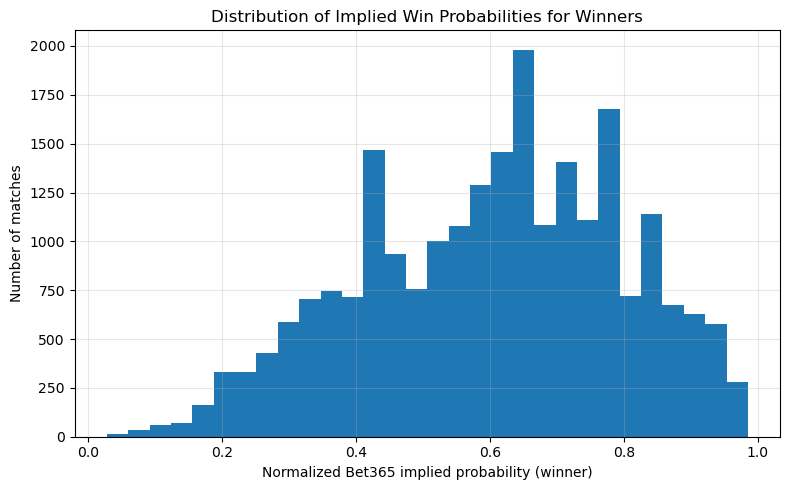
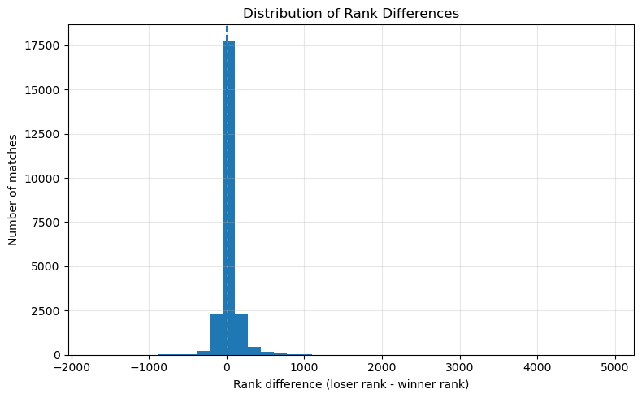
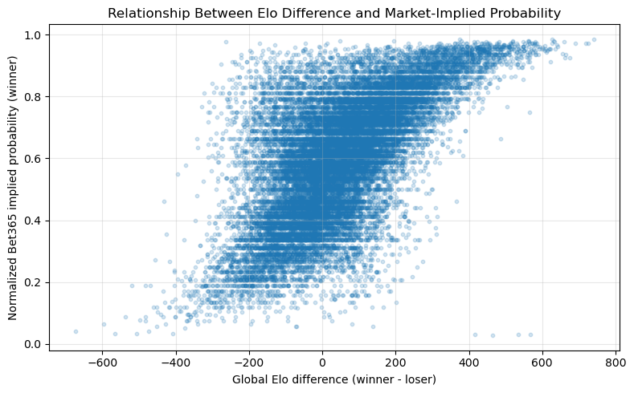
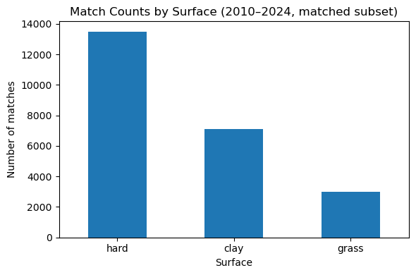

## Data Collection Status

We are building a model to forecast ATP tennis match outcomes using both
historical performance data and betting market information. At this stage,
we have collected and successfully loaded the two core datasets:

1. **Tennis-Data.co.uk (2010–2024)**  
   This dataset provides match-level information including:
   date, tournament, location, surface, round, winner/loser names,
   ATP rankings, set scores, and odds from several bookmakers (e.g. Bet365).
   We have cleaned and combined the yearly files into a single dataset,
   filtered to completed matches, standardized player names, and constructed
   features such as normalized Bet365 implied win probabilities and rank
   differences (loser rank – winner rank).

2. **Jeff Sackmann's ATP match data (2000–2024)**  
   This dataset contains full historical ATP match results, including
   player names, tournament dates, surfaces, and match outcomes. Using this
   data, we computed tennis-specific Elo ratings (global and surface-specific),
   head-to-head (H2H) records between players, and recent form features such
   as number of wins in the last 5–10 matches.

Because the two sources use different naming conventions and dates
(tournament start date vs. match date), we performed a fuzzy match based on
shortened player names and date proximity (matching within ±3 days). This
gives us a merged dataset where about **60%** of matches in the
Tennis-Data.co.uk file have corresponding Elo/H2H/form features from the
Sackmann data.

We estimate that we currently have about **65–70%** of the data we would
ideally like for the final version of the project. Specifically:

- Market odds + match outcomes: essentially 100% for ATP matches 2010–2024.
- Elo, H2H, and recent form features: available for ~60% of those matches
  (the subset where we can confidently match players and dates).
- Detailed ATP player statistics (serve %, return %, etc.): 0% collected so far
  and planned as a later enrichment step.

Our next data-collection step is to scrape or otherwise obtain
serve and return (as well as other relevant) statistics from the ATP website or an equivalent source,
then merge those statistics into the existing modeling dataset.

## Exploratory Data Analysis

To verify that our data is usable and that we understand its structure,
we performed several exploratory analyses on the merged dataset (betting +
Elo/H2H/form). A few key examples:

- **Distribution of implied win probabilities.**

```{r, echo=FALSE, out.width="70%"}

```

We computed normalized Bet365 implied probabilities for the eventual winner.
The distribution is right-skewed, with most winners having pre-match
probabilities between 0.6 and 0.8. A small left tail reflects upset matches,
consistent with tennis being a sport where favorites typically win but surprises
still occur.

- **Distribution of rank differences.**

```{r, echo=FALSE, out.width="70%"}

```

Using rank_diff = lrank − wrank, we see that many matches involve a winner
who was higher-ranked (positive values). The left tail corresponds to ranking
upsets. This confirms that ATP ranking is informative but imperfect.

- **Relationship between Elo difference and market-implied probability.**

```{r, echo=FALSE, out.width="70%"}

```

This scatter plot shows a strong positive relationship: as global Elo
difference (winner Elo − loser Elo) increases, the betting market assigns
higher win probabilities to the winner. This suggests that our Elo system is
capturing similar skill differences to the bookmakers.

- **Surface distribution.**

```{r, echo=FALSE, out.width="70%"}

```

Hard courts account for the largest share of matches, followed by clay and
grass. This matches the ATP calendar and supports including surface type and
surface-specific Elo ratings as key predictors.

## Biggest Unresolved Issue

The single biggest unresolved issue is **integrating detailed ATP player
statistics (serve %, return %, break point stats etc.) into our modeling dataset**.

Conceptually, we would like to include features such as:

- Career and season-level first serve percentage
- First and second serve points won
- Return points won
- Break point conversion and save rates
- Service and return games won

Data Challenges include:

1. Accessing and parsing player statistics pages
2. Normalizing inconsistent player naming conventions
3. Aligning career/seasonal stats with specific match dates
4. Avoiding rate limits and errors during scraping

Our plan for resolving this is to start from an existing scraping repository
(e.g., the `infotennis` project on GitHub that targets ATP stats), adapt it
to our list of players, and store the resulting stats in a separate player-
level table. We can then merge those player-level features into the match-
level modeling dataset by player and year. If scraping proves to be too
fragile, we will explore alternative public datasets (such as Tennis Abstract
CSVs or Kaggle datasets with aggregated player stats).

## External Elements Beyond the Course

We plan to incorporate several elements beyond standard course material:

- **Sports analytics methods.**  
  Custom Elo rating systems, surface adjustments, and dynamic K-factors inspired
  by Jeff Sackmann’s tennis analytics work.

- **Web scraping and data engineering.**  
  Automated scraping of ATP statistics and merging player-level and match-level
  features.
